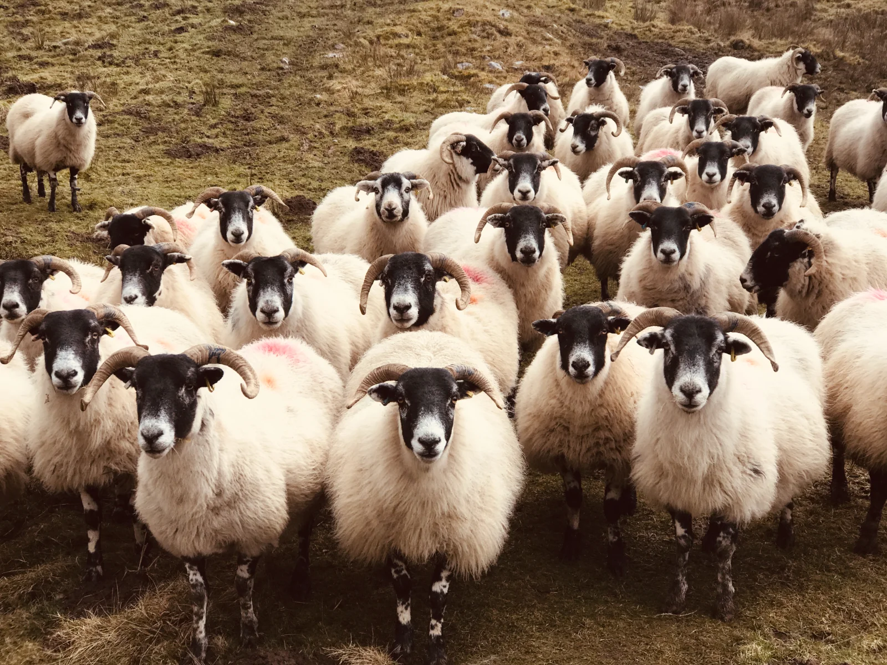

{width=100% fig-align="center"}

A personal learning journal documenting my hobbies, projects and discoveries.

I keep this site to think in the open — tracking what I'm learning, the projects I'm
building, and whatever has captured my curiosity along the way.

## Start here

- [**Now**](now.qmd) — what I'm focused on at the moment
- [**Hobbies**](hobbies/woodworking/index.qmd) — dashboards for each thing I'm learning
- [**Projects**](projects/index.qmd) — everything I've built, across every hobby
- [**Journey**](journey/index.qmd) — a curated timeline of milestones
- [**Reviews**](reviews/index.qmd) — periodic looks back
- [**About**](about.qmd) — who I am
